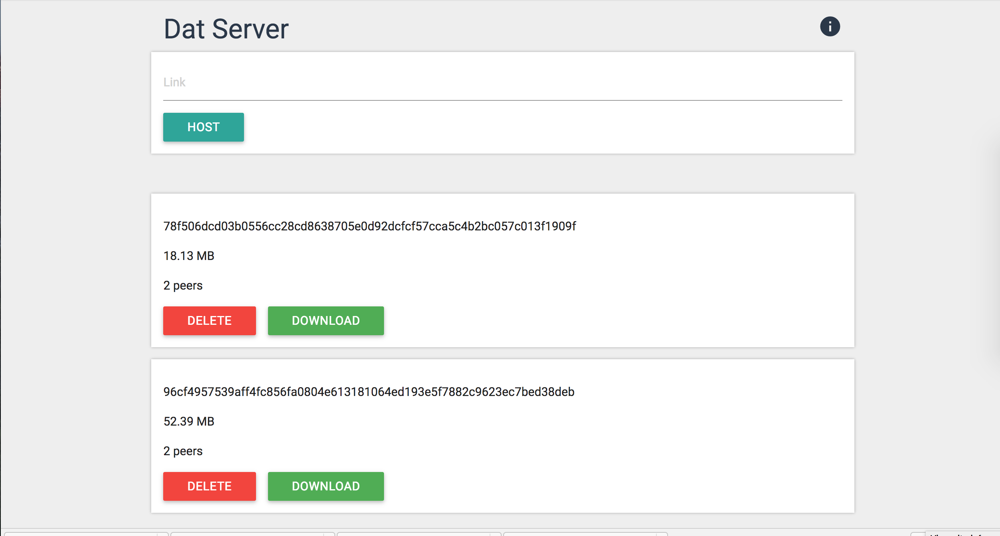

# dat-server

A web interface for managing [dat repositories](http://dat-data.com) on a remote server.



## Installation

1. Clone this repository and install dependencies.

```
git clone https://github.com/karissa/dat-server.git
cd dat-server
npm install
```

2. Create the config

Pay attention to where downloaded dats will be stored. Edit the `location` field so that it suits your setup.

```
cp example.config.json config.json
```

3. Build assets and run the app.

```
npm start
```


# API

### List dats

GET `/dats`

A list of currently deployed dats in JSON format.

### Add a dat

POST `/dats`

with json body:
```
{"key": <DAT_KEY>}
```


TODO: Could return download progress. 

```
{ "progress": 30 }
{ "progress": 100 }
{ "progress": 403 }
```

### Delete a dat

DELETE `/dats`

with json body:

```
{"key": <DAT_KEY>}
```

Delete a dat, removing all data. They key should be the 64-character string without the `dat://` prefix.

